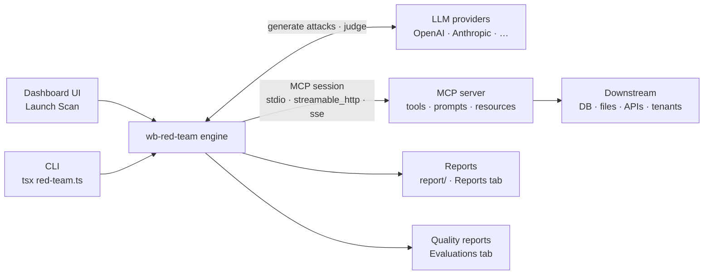
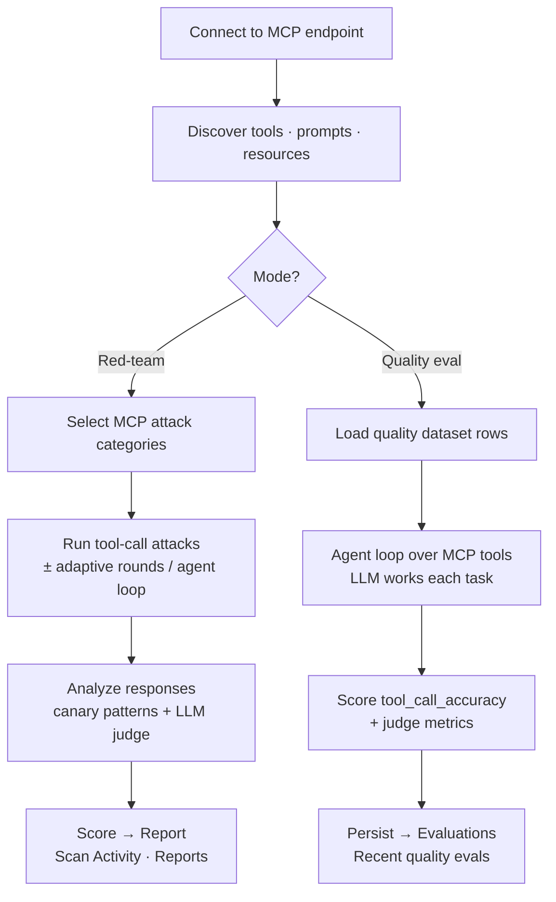

# Test an MCP server — red-team & quality eval

[MCP (Model Context Protocol)](https://modelcontextprotocol.io/) servers expose
tools to LLM clients (Claude Desktop, Cursor, IDE plugins). wb-red-team connects
to the MCP server **directly** — over `stdio` for local servers, or `sse` /
`streamable_http` for network servers — and can run two kinds of test against it:

- **Red-team scan — _is it safe?_** Adversarial attacks against the server's
  tools (tool misuse, cross-tenant access, SSRF, indirect prompt injection, …).
- **Quality eval — _is it good?_** Scores a dataset of realistic tasks for
  correctness (did the agent call the right tools and reach the goal?).

Both are available from the **dashboard UI** and the **CLI**.

## Topology

Where wb-red-team sits relative to your MCP server. The engine never touches the
target's internals — it connects as an ordinary MCP client over the wire, exactly
like Claude Desktop or Cursor would.



- **Connection** — the engine opens an MCP session over the chosen transport and
  auto-discovers the server's tools/prompts/resources. `allowlistedTools` /
  `denylistedTools` scope what it may call.
- **LLM providers** — used to *generate* adversarial attacks (red-team), *drive*
  the agent loop (quality), and *judge* responses. They never see your traffic
  unless you configure them as the target.
- **Outputs** — red-team runs land in `report/` and the **Reports** tab; quality
  runs are persisted and shown under **Evaluations**.

## Anatomy of a run

Both modes share the connect + discover front end, then split:



The red-team path is **adversarial** (does a crafted request make a tool
misbehave?); the quality path is **cooperative** (given a realistic task, does the
agent pick the right tools and reach the goal?). The step-by-step for each is
below.

---

## From the dashboard (UI)

### Step 0 — Connect & verify (shared)

This is the same first step for both a red-team scan and a quality eval.

1. Go to **Launch Scan**.
2. **Target Type → `MCP`**.
3. **Transport**:
   - **Streamable HTTP** — a remote server. Enter the **MCP Server URL**
     (e.g. `https://your-mcp-server.example.com/api/mcp`) and any **Headers**
     (e.g. `x-api-key`, `Authorization: Bearer …`).
   - **Stdio** — a local process (`command` + `args`). Only offered when the
     instance enables it (`ALLOW_MCP_STDIO`); on hosted instances use Streamable
     HTTP. See [stdio safety](#stdio-safety).
4. Click **Test connection & discover tools**. The scanner opens an MCP session
   and lists the server's **tools, prompts, and resources**. On success you'll
   see `Connected to <server> · N tools · N prompts · N resources`, and each
   **discovered tool name is clickable to add to the allowlist**. Always do this
   first — it verifies auth and reachability before you spend a run.
5. **Scope** the run with **Allowlist** / **Denylist** (comma-separated tool
   names). On a live target, allowlist only the tools you're authorized to hit
   and denylist anything destructive.
6. Fill in **Application details** — what the server does, its tenants, high-risk
   operations, and sensitive data. This is the biggest lever on test quality.

### Red-team scan

1. Do **Step 0** above.
2. **Attack categories** — the UI shows only the categories that apply to
   tool-call targets ("Showing the N categories with native MCP attacks — the
   rest don't apply to tool-call targets"). See
   [what red-team catches](#what-red-team-catches).
3. **Strategies** — MCP scans mainly run tool-call seed attacks, so leaving heavy
   LLM generation off is a fine default.
4. **Attack configuration** — `adaptiveRounds` (default 3),
   `maxAttacksPerCategory`, `concurrency`, delay.
5. **Launch.** Watch it in **Scan Activity**; the scored report lands in
   **Reports**.

### Quality eval

1. Toggle the mode at the top of Launch Scan from **Security scan** to
   **Quality eval**. (Attack / template / policy settings are ignored in this
   mode — it scores a dataset for correctness.)
2. **Choose the target:**
   - **Configure new target** — fill in the MCP target section exactly as in
     Step 0 (Target Type `MCP`, transport, URL, headers).
   - **Reuse a previous scan** — pick a prior run from the dropdown; the eval
     runs against that scan's saved target (URL + auth), so secrets never
     round-trip through the browser. The target fields below are ignored.
3. **Quality dataset (required)** — pick a quality dataset from the picker (only
   `kind: quality` datasets are listed). Generate one first in the **Datasets**
   tab if you don't have one — see
   [generate a quality dataset](#generate-a-quality-dataset-for-mcp).
4. **Run quality eval.** Rows stream in with live PASS/FAIL, then a summary
   (average score, passed/total, per-metric badges). The pass threshold is
   `0.7`.
5. Results are **persisted** and appear under **Evaluations → Recent quality
   evals**. Click a run to open its full per-row trace (input, expected tools,
   the agent's actual tool calls, the response, and judge reasoning).

> **How a quality eval drives an MCP target.** MCP speaks JSON-RPC and won't
> accept a plain HTTP request body, so quality eval runs each dataset row through
> an **agent loop**: an LLM is given the server's (allow/deny-scoped) tools and
> works the task, and the eval grades the **tools it actually called** against
> the row's `expectedTools`, plus its **final answer** against the reference. HTTP
> and WebSocket targets use the normal direct-request path instead.

---

## From the CLI

### Red-team

```bash
cp configs/integrations/mcp-server.json configs/config.my-mcp.json
# edit target.mcp.url / headers / applicationDetails / attackConfig
npm start configs/config.my-mcp.json
```

`npm start` is `tsx red-team.ts`; it reads the config path from `argv`. When
`target.type === "mcp"` the runner auto-selects the MCP attack modules from
`attacks-mcp/`. Reports land in `report/` as JSON and Markdown.

**stdio (local) servers**

```json
"mcp": {
  "transport": "stdio",
  "command": "node",
  "args": ["./my-mcp-server/dist/index.js"],
  "env": {}
}
```

**Network (sse / streamable_http) servers**

```json
"mcp": {
  "transport": "streamable_http",
  "url": "http://localhost:9000/mcp",
  "headers": { "Authorization": "Bearer ${MCP_TOKEN}" },
  "allowlistedTools": [],
  "denylistedTools": []
}
```

Set `codebasePath` to your server's source for white-box analysis of tool
handlers.

### Quality eval

The CLI equivalent of the UI's quality eval is `scripts/run-quality-eval.ts`,
which runs the same scorer against a quality dataset + a target config.

---

## Transports

| Transport | Needs | Notes |
|---|---|---|
| `streamable_http` | `url` (+ `headers`) | Remote network server (recommended) |
| `sse` | `url` (+ `headers`) | Remote network server |
| `stdio` | `command` (+ `args`, `env`) | Spawns a local process — gated, see below |

---

## What red-team catches

MCP servers have a distinct threat model — they're tools-as-a-service, often run
with broader local privileges than a typical HTTP agent:

- **`tool_misuse`** — abusing the server's tools against client intent
- **`mcp_server_compromise`** — server-side tool handlers being weaponized (rug-pull)
- **`mcp_tool_namespace_collision`** — tool shadowing when the client has multiple MCP servers loaded
- **`indirect_prompt_injection`** — payloads in tool outputs that flow back into the LLM
- **`ssrf` / `path_traversal`** — classic infra bugs in tool handlers
- **`data_exfiltration`** — read tools (files/DBs) chained to network/email tools
- **`debug_access`** — debug/admin tools that shouldn't be exposed
- **`cross_tenant_access`** — multi-tenant MCP servers leaking across tenants
- **`tool_permission_escalation`** — privileges granted to one tool borrowed by another
- **`insecure_output_handling`** — unsanitized tool output

Set `agentLoop: true` to add agent-in-the-loop tests: poisoned content is planted
in one tool's result and the scanner checks whether the model chains into an
unauthorized write or leaks a planted canary. White-box mode (`codebasePath`)
reads your tool handler implementations and surfaces attacks that exploit
specific code paths.

## What quality eval measures

For an MCP target the relevant metrics are:

- **`tool_call_accuracy`** (deterministic) — order-insensitive F1 of the agent's
  actual tool calls vs the row's `expectedTools`.
- **`goal_accuracy`**, **`topic_adherence`**, **`answer_relevancy`** (LLM judge)
  — did the final answer accomplish the task, stay on topic, and address the
  request?

The full metric set (`tool_call_accuracy`, `goal_accuracy`, `topic_adherence`,
`faithfulness`, `answer_relevancy`, `context_recall`, `exact_match`, `f1`,
`rouge`) is available; a dataset row is graded on whichever `metric` it declares.

## Generate a quality dataset for MCP

In the **Datasets** tab, generate with **Kind = Quality**, **Family = MCP**. The
default task pool is `tool_selection`, `tool_argument_accuracy`,
`multi_step_task`, `goal_completion`, `parameter_extraction`, and the default
metrics are `tool_call_accuracy`, `goal_accuracy`, `topic_adherence`. Each row
carries an `input`, a `reference`/`expectedTools`, and a `metric` — the
`expectedTools` are exactly what the quality eval's agent loop is graded against.
See [Datasets](../datasets.md).

## stdio safety

The `stdio` transport spawns an arbitrary local process on the server, so the
**dashboard API disables it** unless the instance sets `ALLOW_MCP_STDIO=true`
(values `true` / `1` / `yes`). This gate applies to scan launch, quality eval,
and the discover endpoint. The **CLI is unaffected** — `tsx red-team.ts` can
always use stdio. For hosted/shared instances, connect a remote MCP server over
Streamable HTTP instead.
